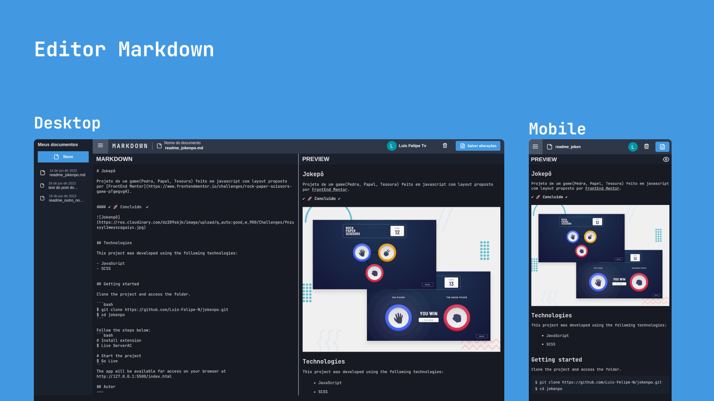

# Jokepô

Projeto de um editor markdown, inspirado em outros editore onde possível criar e armazenar vários arquivos.md.


#### ✔️ 🚀 Concluido  ✔️




## Tecnologias

Este projeto foi desenvolvido com as seguintes tecnologias:

- React
- SCSS
- Firebase

## Iniciar projeto

Clone o projeto e entre na pasta:

```bash
$ git clone https://github.com/Luis-Felipe-N/markdown-editor.git
$ cd markdown-editor
```

Credenciais do firebase:
```
VITE_API_KEY =  ''
VITE_AUTH_DOMAIN = ''
VITE_PROJECT_ID = ''
VITE_STORAGE_BUCKET = ''
VITE_MESSAGIN_SENDER_ID = ''
VITE_APP_ID = ''
```

Follow the steps below:
```bash
# Instalação de dependencias
$ yarn ou npm install

# Iniciando projeto
$ yarn dev ou npm run dev
```
Se tudo dé certo, acesse http://localhost:3000/

## Autor
---

Feito com ❤️ por Luis Felipe
